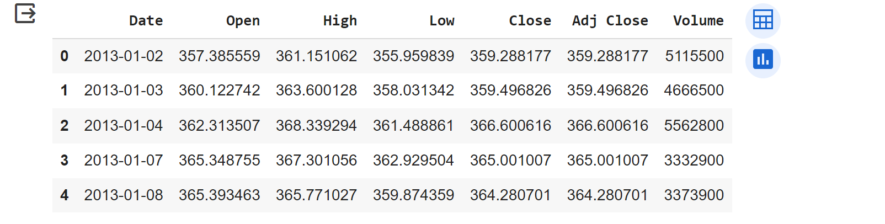
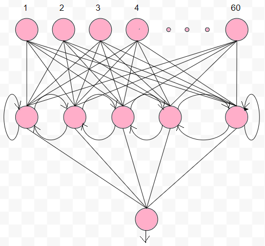
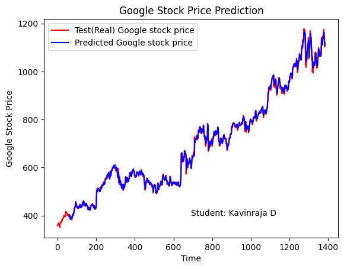
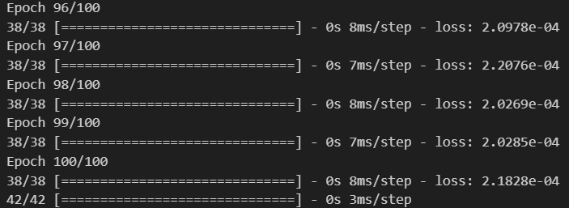

# Stock Price Prediction

## AIM

To develop a Recurrent Neural Network model for stock price prediction.

## Problem Statement and Dataset
We aim to build a RNN model to predict the stock prices of Google using the dataset provided. The dataset has many features, but we will be predicting the "Open" feauture alone. We will be using a sequence of 60 readings to predict the 61st reading. Note: These parameters can be changed as per requirements.
 

## Neural Network Model



## DESIGN STEPS

### STEP 1:
Read the csv file and create the Data frame using pandas.

### STEP 2:
Select the " Open " column for prediction. Or select any column of your interest and scale the values using MinMaxScaler.

### STEP 3:
Create two lists for X_train and y_train. And append the collection of 60 readings in X_train, for which the 61st reading will be the first output in y_train.

### STEP 4:
Create a model with the desired number of nuerons and one output neuron.

### STEP 5:
Follow the same steps to create the Test data. But make sure you combine the training data with the test data.

### STEP 6:
Make Predictions and plot the graph with the Actual and Predicted values


## PROGRAM
### Kavinraja D
### 212222240047
```py

import numpy as np
import matplotlib.pyplot as plt
import pandas as pd
from sklearn.preprocessing import MinMaxScaler
from keras import layers
from keras.models import Sequential
dataset_train = pd.read_csv('trainset.csv')
dataset_train.columns
dataset_train.head()
train_set = dataset_train.iloc[:,1:2].values
type(train_set)
train_set.shape
sc = MinMaxScaler(feature_range=(0,1))
training_set_scaled = sc.fit_transform(train_set)
training_set_scaled.shapeX_train_array = []
y_train_array = []
for i in range(60, 1259):
  X_train_array.append(training_set_scaled[i-60:i,0])
  y_train_array.append(training_set_scaled[i,0])
X_train, y_train = np.array(X_train_array), np.array(y_train_array)
X_train1 = X_train.reshape((X_train.shape[0], X_train.shape[1],1))
X_train.shape
length = 60
n_features = 1
model = Sequential()
model.add(layers.SimpleRNN(10,input_shape=(60,1)))
model.add(layers.Dense(1))

model.compile(optimizer='adam', loss='mse')
model.summary()
model.fit(X_train1,y_train,epochs=100, batch_size=32)
dataset_test = pd.read_csv('testset.csv')
test_set = dataset_test.iloc[:,1:2].values
test_set.shape
dataset_total = pd.concat((dataset_train['Open'],dataset_test['Open']),axis=0)
inputs = dataset_total.values
inputs = inputs.reshape(-1,1)
inputs_scaled=sc.transform(inputs)
X_test = []
for i in range(60,1384):
  X_test.append(inputs_scaled[i-60:i,0])
X_test = np.array(X_test)
X_test = np.reshape(X_test,(X_test.shape[0], X_test.shape[1],1))
X_test.shape
predicted_stock_price_scaled = model.predict(X_test)
predicted_stock_price = sc.inverse_transform(predicted_stock_price_scaled)
plt.plot(np.arange(0,1384),inputs, color='red', label = 'Test(Real) Google stock price')
plt.plot(np.arange(60,1384),predicted_stock_price, color='blue', label = 'Predicted Google stock price')
plt.title('Google Stock Price Prediction')
plt.xlabel('Time')
plt.ylabel('Google Stock Price')
plt.legend()
plt.show()
```

## OUTPUT

### True Stock Price, Predicted Stock Price vs time


### Mean Square Error


## RESULT
